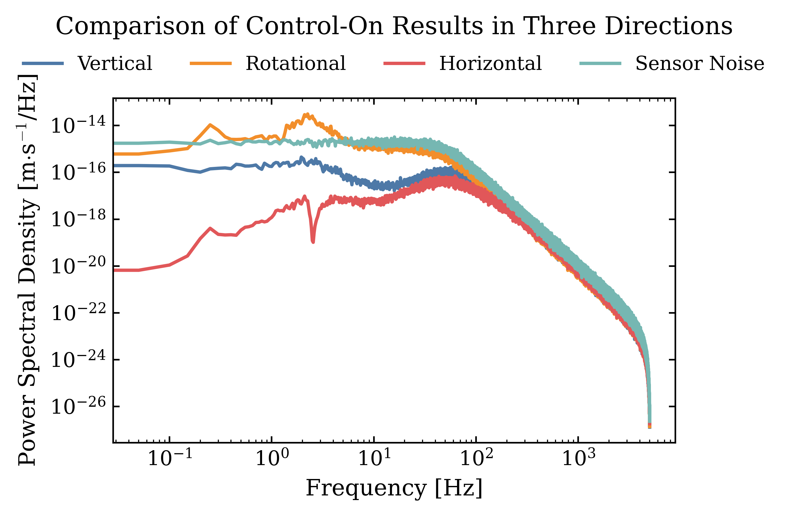

# 基于虚拟通道变换的三自由度解耦与分通道 LQG 控制器设计及结果对比

为便于在多输入多输出（MIMO）对象上实现清晰的物理通道划分与近似解耦控制，本文首先对测量输出与控制输入分别进行线性坐标变换，将原系统从物理量空间映射到“虚拟通道”空间，并在虚拟通道中提取三个近似独立的单输入单输出（SISO）子系统，随后分别完成各通道的 LQG（Kalman 滤波 + LQR）综合，并给出控制开启（control-on）条件下三方向频域性能的对比结果。

## 1) 输出与输入的虚拟通道变换

设原系统测量输出为  
$$
y=[y_1,y_2,y_3,y_4]^\top,
$$

其中 $(y_1,y_3)$ 对应竖直方向的两路测量，$(y_2,y_4)$ 对应水平方向的两路测量。为同时获得“共模/差模”含义明确的观测量，定义虚拟输出向量 $z\in\mathbb{R}^3$ 为
$$
z = T_y\, y,
$$

其中
$$
T_y=
\begin{bmatrix}
0.5 & 0   & 0.5 & 0 \\
0.5 & 0   & -0.5& 0 \\
0   & 0.5 & 0   & -0.5
\end{bmatrix}.
$$

由此得到三个虚拟观测通道：第一通道
$$
z_1=\frac{y_1+y_3}{2}
$$

表征竖直共模分量（本文后续称为 *Vertical*）；第二通道
$$
z_2=\frac{y_1-y_3}{2}
$$

表征竖直差模分量（对应姿态/转动相关分量，后续称为 *Rotational*）；第三通道
$$
z_3=\frac{y_2-y_4}{2}
$$

表征水平方向差模分量（后续称为 *Horizontal*）。该选择的直接目的在于将具有明显对称结构的测量量组合为物理意义更单一的通道，降低耦合项在控制综合中的影响。

对输入侧，设原执行器输入为
$$
u=[u_1,u_2,u_3]^\top.
$$

为利用 $u_1,u_2$ 的对称结构并形成共模/差模驱动，定义虚拟输入
$$
v=[u_\Sigma,u_\Delta,u_3]^\top,
$$

满足
$$
u = T_u\, v,\qquad
T_u=
\begin{bmatrix}
1 & 1 & 0 \\
1 &-1 & 0 \\
0 & 0 & 1
\end{bmatrix},
$$

即
$$
u_1=u_\Sigma+u_\Delta,\qquad
u_2=u_\Sigma-u_\Delta.
$$

在该变换下，竖直共模更主要由 $u_\Sigma$ 激励，竖直差模（转动相关）更主要由 $u_\Delta$ 激励，水平方向通道主要由 $u_3$ 激励，从结构上促成近似解耦。

在原连续状态空间模型 $(A,B_u,C,D_u)$ 的基础上，得到虚拟通道下的等价对象
$$
\dot x = A x + B_u T_u\, v,\qquad
z = T_y C x,
$$

并据此构造 $(z,v)$ 的 $3\times 3$ “虚拟通道对象” $G_{zv}(s)$。进一步取其对角主通道并做最小实现，提取三个 SISO 子系统
$$
G_v(s)=G_{zv,11}(s),\quad
G_{vd}(s)=G_{zv,22}(s),\quad
G_h(s)=G_{zv,33}(s),
$$

分别对应 *Vertical*、*Rotational* 与 *Horizontal* 三个控制通道。本文对象各通道的状态维数为 $n=8$，因此后续 LQG 设计均在八维状态空间上进行。

## 2) 分通道 Kalman 滤波器设计（状态估计）

在每个 SISO 通道上，采用标准线性高斯假设构造 Kalman 滤波器。令过程噪声与测量噪声分别为 $w$ 与 $\nu$，并取过程噪声通过矩阵 $G=I_n$ 进入系统，即
$$
\dot x = A x + B u + w,\qquad
y = C x + \nu,
$$

其中
$$
w\sim\mathcal{N}(0,W),\qquad
\nu\sim\mathcal{N}(0,V).
$$

本文以通道差异为依据设置过程噪声强度：竖直相关通道（$G_v,G_{vd}$）使用 $\sigma_{wz}=10^{-6}$ 的强度，水平通道（$G_h$）使用 $\sigma_{wx}=10^{-6}$。对应地，过程噪声协方差取
$$
W=\beta_Q\,\sigma_w^2 I_n,\qquad \beta_Q=1.
$$

测量噪声标准差统一取 $\sigma_v=10^{-9}$，测量噪声协方差取
$$
V=\beta_R\,\sigma_v^2,\qquad \beta_R=1.
$$

由此通过线性二次估计（LQE）得到各通道 Kalman 增益 $L,L_2,L_3$。

## 3) 分通道 LQR 设计（性能权衡与量纲归一化）

为使不同方向输出在代价函数中具有可比性，本文引入“典型量级”进行归一化加权。对竖直方向通道取典型量级
$$
V_{\mathrm{mag}}=10^{-4},
$$

对水平方向通道取
$$
H_{\mathrm{mag}}=10^{-5}.
$$

以 SISO 通道输出 $y$ 为例，引入归一化系数
$$
S_y=\mathrm{diag}\!\left(\frac{1}{y_{\mathrm{mag}}}\right),
$$

则输出加权可写成
$$
W_y=S_y^\top S_y.
$$

进而采用“由输出权重回推状态权重”的构造：
$$
Q_{\mathrm{base}}=C^\top W_y C,\qquad
R_{\mathrm{base}}=1,
$$

并用标度参数 $\alpha_Q,\alpha_R$ 调整“输出抑制强度”和“控制力惩罚强度”：
$$
Q=\alpha_Q Q_{\mathrm{base}},\qquad
R=\alpha_R R_{\mathrm{base}}.
$$

竖直共模通道 $G_v$ 取
$$
\alpha_Q=1,\quad \alpha_R=0.1;
$$

竖直差模/转动通道 $G_{vd}$ 取
$$
\alpha_Q=5\times 10^{-4},\quad \alpha_R=0.1,
$$

相对更温和的输出惩罚，以避免对该通道的过强控制导致不必要的力注入；水平通道 $G_h$ 取
$$
\alpha_Q=1,\quad \alpha_R=0.1,
$$

但其 $W_y$ 基于 $H_{\mathrm{mag}}$ 构造。由 LQR 得到状态反馈增益 $K,K_2,K_3$。

## 4) LQG 动态输出反馈综合

在分离原理成立条件下（线性、可检测与可稳定），每个通道的 LQG 控制器可写为标准的“估计器 + 状态反馈”结构：
$$
\dot{\hat x} = (A - B K - L C)\hat x + L\,y,\qquad
u = -K \hat x.
$$

对应的控制器状态空间实现为
$$
A_c = A - BK - LC,\quad
B_c=L,\quad
C_c=-K,\quad
D_c=0,
$$

并分别对三个通道得到
$$
(A_{c1},B_{c1},C_{c1},D_{c1}),\quad
(A_{c2},B_{c2},C_{c2},D_{c2}),\quad
(A_{c3},B_{c3},C_{c3},D_{c3}).
$$

在整体实现上，控制律在虚拟空间产生 $v$ 后再通过
$$
u=T_u v
$$

映射回物理执行器输入；测量则由
$$
z=T_y y
$$

送入对应通道控制器，从而形成“变换—分通道控制—逆变换”的闭环结构。

## 5) 频域仿真结果与讨论（Control-on）

图中给出了控制开启条件下三方向输出的功率谱密度（PSD）对比，并同时给出传感器噪声谱作为参考基线。总体上可观察到以下规律：在低频段（约 $10^{-1}\sim 10^{1}\,\mathrm{Hz}$），三个方向的闭环谱水平呈现明显差异，其中 *Horizontal* 通道的谱密度最低，*Vertical* 次之，而 *Rotational* 在约 $10^{0}\sim 10^{0.5}\,\mathrm{Hz}$ 附近出现更显著的峰值特征，表明该方向受轻阻尼模态或耦合残余的影响更强，闭环抑制能力相对受限。结合本文对转动通道采用较小 $\alpha_Q$ 的设定，这一现象也符合“控制更温和、允许更大的残余输出但减少力注入”的设计取向。

在中频段（约 $10^{1}\sim 10^{2}\,\mathrm{Hz}$），各曲线逐渐逼近传感器噪声曲线，表现出典型的“噪声受限”行为：此频段内闭环输出主要由测量噪声经估计与反馈通道传递所主导，进一步提升抑制需要更低的测量噪声或更合理的观测/执行器配置，而单纯提高反馈增益往往会以更大控制力代价换取有限收益。

在高频段（大于约 $10^{2}\,\mathrm{Hz}$），三方向谱密度随频率快速滚降并近似保持相似斜率，说明闭环对高频扰动与噪声的传递被有效抑制；这与 Kalman 滤波对高频测量噪声的抑制以及对象高频动力学特性共同作用一致。整体而言，仿真结果表明：通过输出/输入虚拟通道变换获得的近似解耦结构能够支持分通道 LQG 控制的工程实现，并在宽频范围内形成以中频噪声基线为界的“低频抑制—中频噪声受限—高频滚降”的典型闭环谱形态，从而实现三方向控制性能的可比性评估与参数权衡。
